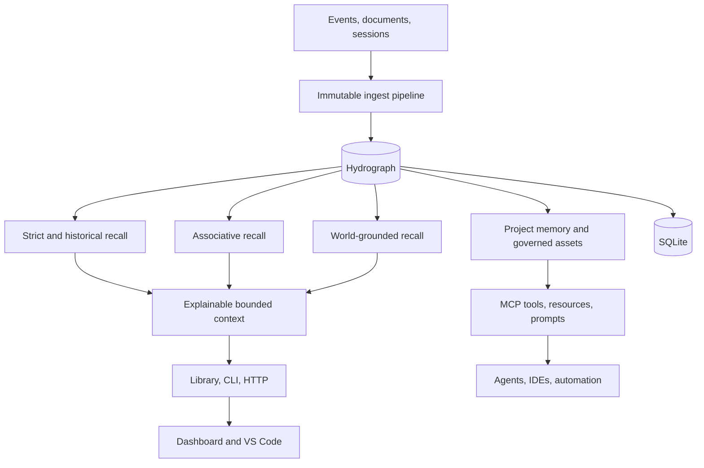

<!--
     __                      __  ___
    / /   ____  ____  ____ _/  |/  /__  ____ ___  ____  _______  __
   / /   / __ \/ __ \/ __ `/ /|_/ / _ \/ __ `__ \/ __ \/ ___/ / / /
  / /___/ /_/ / / / / /_/ / /  / /  __/ / / / / / /_/ / /  / /_/ /
 /_____/\____/_/ /_/\__, /_/  /_/\___/_/ /_/ /_/\____/_/   \__, /
                     /____/                                 /____/

 cavira oss (c) 2026  -  nullure (c) 2026
 ==========================================================
 file  : README.md
 usage : introduces LongMemory, its architecture, integrations, and deployment options
-->

# LongMemory

> **Durable, temporal, governed memory for AI agents. Not just RAG. Not just a vector database. Local-first and self-hosted.**

[](https://www.npmjs.com/package/longmemory)
[](https://marketplace.visualstudio.com/items?itemName=CaviraOSS.longmemory-vscode)
[](https://github.com/CaviraOSS/LongMemory/pkgs/container/longmemory)
[](LICENSE)


LongMemory is a cognitive memory engine for LLM applications and autonomous agents.

- Durable local-first storage with SQLite
- Immutable content, provenance, and temporal truth
- Strict, historical, associative, grounded, and multilingual recall
- Explainable evidence selection and token-bounded context
- Governed project memory, Skills, Chat Memory, LLM-Wiki, and CodeGraph
- One TypeScript engine across npm, CLI, HTTP, MCP, dashboard, and VS Code
- Native integrations for agent hosts, automation tools, and Python frameworks

Your model stays stateless. **Your application stops being amnesiac.**

---

## 1. Use It in 10 Seconds

### Install as a library

```bash
npm install longmemory
```

```ts
import { createMemory } from 'longmemory';

const memory = await createMemory();
await memory.ingest({
    user_id: 'alice',
    text: 'I prefer TypeScript for backend services',
});

const result = await memory.recall({
    text: 'What language does Alice prefer?',
    mode: 'strict',
});

console.log(result);
await memory.close();
```

No service or external database is required for in-memory use.

### Persist with SQLite

```ts
const memory = await createMemory({
    store: 'sqlite',
    db_path: './longmemory.db',
    tenant_id: 'acme',
    user_id: 'alice',
});
```

Reopening the same database restores nodes, worlds, entities, edges, temporal history, grounding, and lifecycle state.

### Install the CLI

```bash
npm install --global longmemory
longmemory init
longmemory recall "current project priorities" --mode associative
```

---

## 2. Run as a Service

### From source

```bash
git clone https://github.com/CaviraOSS/LongMemory.git
cd LongMemory
corepack enable
pnpm install --frozen-lockfile
pnpm build
pnpm start
```

The API listens on `http://127.0.0.1:7331` by default.

### Docker

```bash
docker run --rm \
  -p 7331:7331 \
  -v longmemory-data:/data \
  -e LONGMEMORY_API_KEY=change-me \
  ghcr.io/caviraoss/longmemory:latest
```

### Docker Compose

```bash
cp .env.example .env
docker compose up --build -d longmemory
```

Include the dashboard:

```bash
docker compose --profile ui up --build -d
```

- API and MCP: `http://127.0.0.1:7331`
- Dashboard: `http://127.0.0.1:3000`
- Health: `http://127.0.0.1:7331/health`

---

## 3. Why LongMemory

Most systems called memory are retrieval pipelines:

1. Split text into chunks.
2. Embed the chunks.
3. Return the nearest vectors.

That does not establish what was true at a particular time, whether a new fact superseded an old one, which source is authoritative, who may see it, or why a result belongs in context.

LongMemory models those concerns directly:

- **Temporal truth:** recorded time and valid time are separate.
- **Immutable memory:** content, vectors, hashes, and provenance are not rewritten by recall or decay.
- **Executable graph:** typed relationships participate in recall and explanation.
- **Governance:** project, tenant, user, team, role, agent, task, and framework scope are enforced.
- **Lifecycle:** deterministic decay, explicit reinforcement, consolidation, compression, and reconsolidation.
- **Evidence:** recall is bounded by relevance, contradictions, grounding, permissions, and token cost.

See [Why.md](Why.md) for the design rationale.

---

## 4. Recall Modes

```ts
const strict = await memory.recall({
    text: 'What is the current deployment region?',
    mode: 'strict',
});

const historical = await memory.recall({
    text: 'What was the deployment region in January?',
    mode: 'historical',
    valid_time: Date.UTC(2026, 0, 15),
});

const associative = await memory.recall({
    text: 'Incidents related to the payment migration',
    mode: 'associative',
});

const grounded = await memory.recall({
    text: 'Which production endpoint is currently live?',
    mode: 'world_grounded',
});
```

Strict recall applies temporal, contradiction, contract, confidence, and grounding gates. Historical recall preserves superseded truth. Associative recall follows semantic, lexical, entity, activation, and graph signals. World-grounded recall requires current external evidence.

---

## 5. Features

- **Hydrograph memory substrate** with immutable nodes, executable edges, worlds, entities, facets, and traces.
- **Temporal reasoning** with point-in-time truth, event ordering, supersession, and stale-evidence controls.
- **Multilingual memory** with script detection, code switching, transliteration, and cross-language embeddings.
- **Project memory** for architecture, decisions, tasks, conventions, failures, handoffs, and code impact.
- **Codex central memory** with four-level project/role/task/formal-memory scope, immutable versions, explicit confirmations, conflict governance, bounded per-task working sets, and governed L4-only links between otherwise isolated projects.
- **Obsidian projection** that renders central SQLite truth as an atomic, read-only Markdown vault, including project-link audit records, history-publication governance queues, immutable plans/attempts, and a separate proposal inbox.
- **Governed assets** for Chat Memory, Skills, LLM-Wiki, and CodeGraph with lifecycle and ACL policy.
- **Session porter** for Claude Code, Codex, OpenCode, Gemini CLI, Copilot Chat, Cline, and raw harness logs.
- **Connectors** for repositories, local files, Markdown, web content, feeds, cloud documents, and provider APIs.
- **Embeddings** through OpenAI-compatible APIs, Gemini, AWS Bedrock, Ollama, Siray, and local HTTP models.
- **Operational surfaces** through HTTP, MCP, dashboard, VS Code, n8n, and framework-native MCP clients.
- **Auditable benchmarks** for LongMemEval, LoCoMo, BEAM, retrieval quality, temporal behavior, and latency.

---

## 6. MCP and Agent Integrations

Start local stdio MCP:

```bash
longmemory mcp --db .longmemory/project.db --project current
```

Expose authenticated Streamable HTTP MCP:

```bash
LONGMEMORY_API_KEY=change-me longmemory serve --mcp-http
```

LongMemory exposes 13 high-level governed tools plus readable resources and agent workflow prompts. Tool arguments cannot override server-bound runtime identity.

Installable integrations include:

- Claude Code plugin
- Codex and ChatGPT desktop plugin
- Gemini CLI extension
- Agent Plugins 1.0 bundle for OpenClaw and compatible hosts
- n8n community node usable as an AI Agent tool
- Cline, Continue, and LibreChat configuration packs
- Dify and Flowise native MCP setup
- CrewAI, AutoGen, LangGraph/LangChain, OpenAI Agents SDK, and PydanticAI examples

The Codex plugin uses lifecycle hooks for bounded recall and turn finalization;
SQLite remains the authority while each task receives only its relevant working
set. See [the Codex integration guide](integrations/codex-longmemory/README.md),
[integrations/README.md](integrations/README.md), and [docs/mcp.md](docs/mcp.md).

---

## 7. Temporal and Project Memory

```ts
import { createProjectMemory } from 'longmemory';

const projects = await createProjectMemory({
    tenant_id: 'cavira',
    organization_id: 'CaviraOSS',
    project_id: 'longmemory',
    name: 'LongMemory',
    store: 'sqlite',
    db_path: './longmemory.db',
});

await projects.ingestProjectEvent('longmemory', {
    kind: 'decision',
    topic: 'persistence',
    text: 'Use SQLite for local-first persistence',
    source_type: 'architecture_note',
});

const context = await projects.getProjectContext('longmemory', 'prepare the next release');
```

Project context combines relevant architecture, current decisions, open tasks, failures, code facts, matched Skills, conflicts, and governed asset loadouts under one token budget.

---

## 8. CLI

```bash
longmemory init
longmemory tui
longmemory status --memories 20 --json
longmemory ingest "Remember the rollback procedure" --type procedure
longmemory recall "What is the rollback procedure?" --mode associative
longmemory memory list --limit 50
longmemory project context "prepare the next release"
longmemory maintenance decay --all
longmemory maintenance reinforce <memory-id>
longmemory skill match "run the release checklist" --agent reviewer
longmemory asset loadout "prepare the release" --agent reviewer --framework codex
longmemory code impact createMemory
longmemory detect
longmemory session discover --from claude-code
longmemory history inventory --from codex --all
longmemory history plan --from codex --all
longmemory port --from codex --to longmemory --id <confirmed-session-id> --history-manifest ./history-overrides.json --project <confirmed-project-id> --db ./central-memory.db
longmemory history govern accept_hierarchy <publication-id> --proposal-id <proposal-id> --db ./central-memory.db --project <confirmed-project-id> --action-id <action-id> --confirm-human
longmemory history confirm approve <confirmation-id> --db ./central-memory.db --project <confirmed-project-id> --action-id <action-id> --confirm-human
longmemory project link create novel ai-painting --two-way --db ./central-memory.db --project novel --action-id link-novel-art-001 --confirm-human
longmemory project link list --db ./central-memory.db --project novel
longmemory port --from claude-code --to longmemory --all
longmemory session wiki --from gemini-cli --all --name "Project knowledge"
longmemory obsidian project --db ./central-memory.db --vault ./KnowledgeVault
longmemory serve --mcp-http
```

Finite commands emit stable JSON outside a TTY or when `--json` is supplied. The session porter reads supported coding-agent stores without modifying them. See [docs/cli.md](docs/cli.md).

---

## 9. Management Surfaces

The Next.js dashboard provides health, memory browsing, ingestion, search, project selection, activity, decay, settings, timelines, and memory-aware chat through a same-origin API proxy.

```bash
pnpm --dir dashboard build
pnpm --dir dashboard start
```

The VS Code extension provides an activity-bar browser, status bar, recall, project context, explanation, reinforcement, explicit decay, session import, and reviewed AI-change capture.

For local knowledge governance, project the central-memory SQLite database into
an Obsidian-compatible Markdown vault:

```bash
longmemory obsidian project \
  --db ./central-memory.db \
  --vault ./KnowledgeVault
```

The projection is deterministic and atomic. Generated pages are read-only
views of SQLite; LongMemory refuses to overwrite externally edited generated
files. Put human-authored changes under `LongMemory/Proposals/inbox/` for later
review instead of editing generated pages directly. Obsidian itself is optional:
the command can generate and refresh the Markdown vault before the desktop app
is installed. The generated home page also separates pending hierarchy review,
pending content review, and pending central confirmation. Historical candidates,
hierarchy proposals, human decisions, immutable publication plans, and execution
attempts each have auditable pages; none of those pages can approve or publish a
memory by being edited.

Projects stay isolated by default. A human can create a directed or two-way
project link with `longmemory project link create`. Each direction permits only
query-relevant L4 memory to cross into the target project's task working set;
L1-L3 hierarchy and rules never cross. Linked memory is labelled separately
and ranks below current-task and local-project memory. Revoking a direction
retracts its existing linked worksets and blocks new recall.

```bash
pnpm extension:package
```

The generated package is `apps/vscode-extension/longmemory-vscode-0.2.0.vsix`.

---

## 10. Architecture



Read [ARCHITECTURE.md](ARCHITECTURE.md) and [docs/architecture.md](docs/architecture.md) for subsystem details.

---

## 11. Deployment Options

| Platform       | Configuration          | What it deploys                           |
| -------------- | ---------------------- | ----------------------------------------- |
| Docker         | `Dockerfile`           | API and Streamable HTTP MCP               |
| Docker Compose | `docker-compose.yml`   | API/MCP plus optional dashboard           |
| Heroku         | `app.json`             | Containerized API/MCP                     |
| Railway        | `railway.json`         | Containerized API/MCP                     |
| Render         | `render.yaml`          | API/MCP with persistent disk              |
| DigitalOcean   | `.do/spec.yaml`        | App Platform API/MCP service              |
| Vercel         | `vercel.json`          | Dashboard; configure `LONGMEMORY_API_URL` |
| Windows        | `start-longmemory.ps1` | Background local API/MCP process          |

For hosted API deployments, set `LONGMEMORY_API_KEY`, mount persistent storage at `/data`, and terminate TLS at the platform edge. Vercel hosts only the stateless dashboard and requires a separately deployed LongMemory API.

---

## 12. Benchmarks

```bash
pnpm bench
pnpm bench:ci
pnpm bench:full
```

The benchmark harness publishes explicit manifests, dataset completion, evidence metrics, answer judgments, temporal categories, latency percentiles, and N/A reasons. Official scorecards fail closed on incomplete datasets or semantic embedding fallback. See [benchmarks/README.md](benchmarks/README.md).

---

## 13. Migration

Import supported SQLite, JSON, or JSONL memory:

```bash
longmemory migrate \
  --from ./legacy.db \
  --to ./longmemory.db \
  --report ./migration-report.json
```

Import coding-agent conversations as governed Chat Memory:

```bash
longmemory history inventory --from codex --all
longmemory history plan --from codex --all
longmemory port --from codex --to longmemory --id <confirmed-session-id> --history-manifest ./history-overrides.json --project <confirmed-project-id> --db ./central-memory.db
```

Codex histories are planned before import because one local history store can
contain many unrelated projects. `history inventory` and `history plan` are
read-only; the planner preserves task, parent-task, session, and fork identities
and emits a strict override-manifest template for human confirmation. A blanket
`port --from codex --all` is intentionally rejected so separate projects cannot
be collapsed into one database scope. Save `plan.override_manifest_template`,
review it, and set only approved assignments to `confirmed: true`. The manifest
is bound to the complete reviewed source set, every JSONL file's
newline-committed byte cutoff and SHA-256 prefix, each portable session's
content revision, and a reconciliation digest accounting for every source
file. Appends and newly created tasks after that snapshot are deferred to the
next inventory; changes or truncation before an approved cutoff fail closed.
Malformed, unreadable, or partially parsed session files block authorization;
empty and explicitly excluded tasks remain visible as non-importable scan
counts.
Codex import then requires that file plus explicit `--project` and `--db` values;
every selected ID must be confirmed for that exact project. Credential matches
remain blocked by default. The generated manifest may be explicitly confirmed
to authorize the exact versioned, deterministic in-memory redaction proposal;
that approval binds the derived revision, exact terminal markers, and
secret-free span audit data without exposing a hash of the credential-bearing
source object.
The importer writes
the authorized inventory, reconciliation, plan, manifest, source-revision,
project, and database receipt into asset metadata while reusing the exact frozen
derived snapshot it checked. It stages immutable history chunks containing the
original text only for clean sessions and stable placeholders for approved
credential spans. Capability-scoped workers extract and consolidate candidates;
publication is a separate governed boundary. New hierarchy, changed content,
conflicts, and level-1/major rules cannot become effective through the history
worker alone.

Reviewed history decisions can be submitted through `history govern`, while
level-1, major-rule, and conflict confirmations use `history confirm`. Both are
trusted local operations: they require an existing explicit database, an exact
project, a unique action ID, and a bare `--confirm-human` attestation. The CLI
derives the actor and evidence from its resolved local user. The bundled Codex
MCP gateway never exposes approver actions. See the
[CLI governance reference](docs/cli.md#govern-codex-history-publication) and
[MCP security model](docs/mcp.md#local-stdio).

See [MIGRATION.md](MIGRATION.md) and [docs/migration.md](docs/migration.md).

---

## 14. Release and Operations

```bash
corepack enable
pnpm install --frozen-lockfile
pnpm release:check
pnpm pack
pnpm extension:package
```

`release:check` validates branding, types, integration manifests, the benchmark smoke gate, the root build, extension build, and dashboard production build.

Useful Make targets:

```bash
make install
make build
make check
make docker-up
make dashboard
```

---

## 15. Security

LongMemory is local-first, but network deployment still requires explicit controls:

- Protect API and MCP routes with `LONGMEMORY_API_KEY`.
- Restrict allowed origins and terminate TLS at the edge.
- Keep connector and embedding credentials outside repository files.
- Treat recalled content as untrusted evidence, not authorization.
- Preserve server-bound user, project, agent, and framework identity.

Report vulnerabilities privately as described in [SECURITY.md](SECURITY.md).

---

## 16. Contributing

Issues and pull requests are welcome. Read [CONTRIBUTING.md](CONTRIBUTING.md), [GOVERNANCE.md](GOVERNANCE.md), and [CODE_OF_CONDUCT.md](CODE_OF_CONDUCT.md) before contributing.

- Issues: https://github.com/CaviraOSS/LongMemory/issues
- Discussions: https://github.com/CaviraOSS/LongMemory/discussions
- Changelog: [CHANGELOG.md](CHANGELOG.md)

---

## 17. License

LongMemory is licensed under the [Apache License 2.0](LICENSE). The separately
published n8n community node uses MIT as required by n8n's strict package
validator. Upstream attribution and the scope of this distribution's changes
are recorded in [NOTICE](NOTICE).

## Contributors

<!-- readme: contributors -start -->
<table>
	<tbody>
		<tr>
            <td align="center">
                <a href="https://github.com/nullure">
                    
                    <br />
                    <sub><b>Morven</b></sub>
                </a>
            </td>
            <td align="center">
                <a href="https://github.com/dontbanmeplz">
                    
                    <br />
                    <sub><b>Chis</b></sub>
                </a>
            </td>
            <td align="center">
                <a href="https://github.com/amihos">
                    
                    <br />
                    <sub><b>Hossein Amirkhalili</b></sub>
                </a>
            </td>
            <td align="center">
                <a href="https://github.com/DKB0512">
                    
                    <br />
                    <sub><b>DKB</b></sub>
                </a>
            </td>
            <td align="center">
                <a href="https://github.com/stevo1403">
                    
                    <br />
                    <sub><b>Stephen Adebayo</b></sub>
                </a>
            </td>
            <td align="center">
                <a href="https://github.com/mameikagou">
                    
                    <br />
                    <sub><b>mrlonely</b></sub>
                </a>
            </td>
		</tr>
		<tr>
            <td align="center">
                <a href="https://github.com/haosenwang1018">
                    
                    <br />
                    <sub><b>Sense_wang</b></sub>
                </a>
            </td>
            <td align="center">
                <a href="https://github.com/recabasic">
                    
                    <br />
                    <sub><b>Elvoro</b></sub>
                </a>
            </td>
            <td align="center">
                <a href="https://github.com/zfaustk">
                    
                    <br />
                    <sub><b>Clio</b></sub>
                </a>
            </td>
            <td align="center">
                <a href="https://github.com/suyua9">
                    
                    <br />
                    <sub><b>suyua9</b></sub>
                </a>
            </td>
            <td align="center">
                <a href="https://github.com/vincenzopalazzo">
                    
                    <br />
                    <sub><b>Vincenzo Palazzo</b></sub>
                </a>
            </td>
            <td align="center">
                <a href="https://github.com/msris108">
                    
                    <br />
                    <sub><b>Sriram M</b></sub>
                </a>
            </td>
		</tr>
		<tr>
            <td align="center">
                <a href="https://github.com/fparrav">
                    
                    <br />
                    <sub><b>Felipe Parra</b></sub>
                </a>
            </td>
            <td align="center">
                <a href="https://github.com/DoKoB0512">
                    
                    <br />
                    <sub><b>DoKoB0512</b></sub>
                </a>
            </td>
            <td align="center">
                <a href="https://github.com/whiterabb17">
                    
                    <br />
                    <sub><b>MistrHyde</b></sub>
                </a>
            </td>
            <td align="center">
                <a href="https://github.com/octo-patch">
                    
                    <br />
                    <sub><b>Octopus</b></sub>
                </a>
            </td>
            <td align="center">
                <a href="https://github.com/therexone">
                    
                    <br />
                    <sub><b>Ayush Singh</b></sub>
                </a>
            </td>
            <td align="center">
                <a href="https://github.com/kishan0725">
                    
                    <br />
                    <sub><b>Kishan Lal</b></sub>
                </a>
            </td>
		</tr>
		<tr>
            <td align="center">
                <a href="https://github.com/pc-quiknode">
                    
                    <br />
                    <sub><b>Peter Chung</b></sub>
                </a>
            </td>
            <td align="center">
                <a href="https://github.com/muhammad-fiaz">
                    
                    <br />
                    <sub><b>Muhammad Fiaz</b></sub>
                </a>
            </td>
            <td align="center">
                <a href="https://github.com/jasonkneen">
                    
                    <br />
                    <sub><b>Jason Kneen</b></sub>
                </a>
            </td>
            <td align="center">
                <a href="https://github.com/Hchunjun">
                    
                    <br />
                    <sub><b>shan</b></sub>
                </a>
            </td>
            <td align="center">
                <a href="https://github.com/naabakkcrypto">
                    
                    <br />
                    <sub><b>Naabakk</b></sub>
                </a>
            </td>
            <td align="center">
                <a href="https://github.com/mikemikimike">
                    
                    <br />
                    <sub><b>mikemikimike</b></sub>
                </a>
            </td>
		</tr>
		<tr>
            <td align="center">
                <a href="https://github.com/mgajewskik">
                    
                    <br />
                    <sub><b>Maciej Gajewski</b></sub>
                </a>
            </td>
            <td align="center">
                <a href="https://github.com/ajitam">
                    
                    <br />
                    <sub><b>Matija Urh</b></sub>
                </a>
            </td>
            <td align="center">
                <a href="https://github.com/machj8968-lab">
                    
                    <br />
                    <sub><b>machj8968-lab</b></sub>
                </a>
            </td>
            <td align="center">
                <a href="https://github.com/buyua9">
                    
                    <br />
                    <sub><b>buyua9</b></sub>
                </a>
            </td>
            <td align="center">
                <a href="https://github.com/aziham">
                    
                    <br />
                    <sub><b>Hamza</b></sub>
                </a>
            </td>
            <td align="center">
                <a href="https://github.com/oantoshchenko">
                    
                    <br />
                    <sub><b>Oleksandr Antoshchenko</b></sub>
                </a>
            </td>
		</tr>
		<tr>
            <td align="center">
                <a href="https://github.com/lwsinclair">
                    
                    <br />
                    <sub><b>Lawrence Sinclair</b></sub>
                </a>
            </td>
            <td align="center">
                <a href="https://github.com/jungdaesuh">
                    
                    <br />
                    <sub><b>jungdaesuh</b></sub>
                </a>
            </td>
            <td align="center">
                <a href="https://github.com/josephgoksu">
                    
                    <br />
                    <sub><b>Joseph Goksu</b></sub>
                </a>
            </td>
            <td align="center">
                <a href="https://github.com/EikoocS">
                    
                    <br />
                    <sub><b>EikoocS</b></sub>
                </a>
            </td>
            <td align="center">
                <a href="https://github.com/Dhravya">
                    
                    <br />
                    <sub><b>Dhravya Shah</b></sub>
                </a>
            </td>
            <td align="center">
                <a href="https://github.com/dflor003">
                    
                    <br />
                    <sub><b>Danil Flores</b></sub>
                </a>
            </td>
		</tr>
		<tr>
            <td align="center">
                <a href="https://github.com/DAESA24">
                    
                    <br />
                    <sub><b>DAESA24</b></sub>
                </a>
            </td>
            <td align="center">
                <a href="https://github.com/ammesonb">
                    
                    <br />
                    <sub><b>Brett Ammeson</b></sub>
                </a>
            </td>
            <td align="center">
                <a href="https://github.com/auto-pr-bot">
                    
                    <br />
                    <sub><b>auto-pr-bot</b></sub>
                </a>
            </td>
            <td align="center">
                <a href="https://github.com/Anush008">
                    
                    <br />
                    <sub><b>Anush</b></sub>
                </a>
            </td>
            <td align="center">
                <a href="https://github.com/annelchavez-11594">
                    
                    <br />
                    <sub><b>Annel Chavez</b></sub>
                </a>
            </td>
            <td align="center">
                <a href="https://github.com/atao2004">
                    
                    <br />
                    <sub><b>Anna Tao</b></sub>
                </a>
            </td>
		</tr>
	<tbody>
</table>
<!-- readme: contributors -end -->
