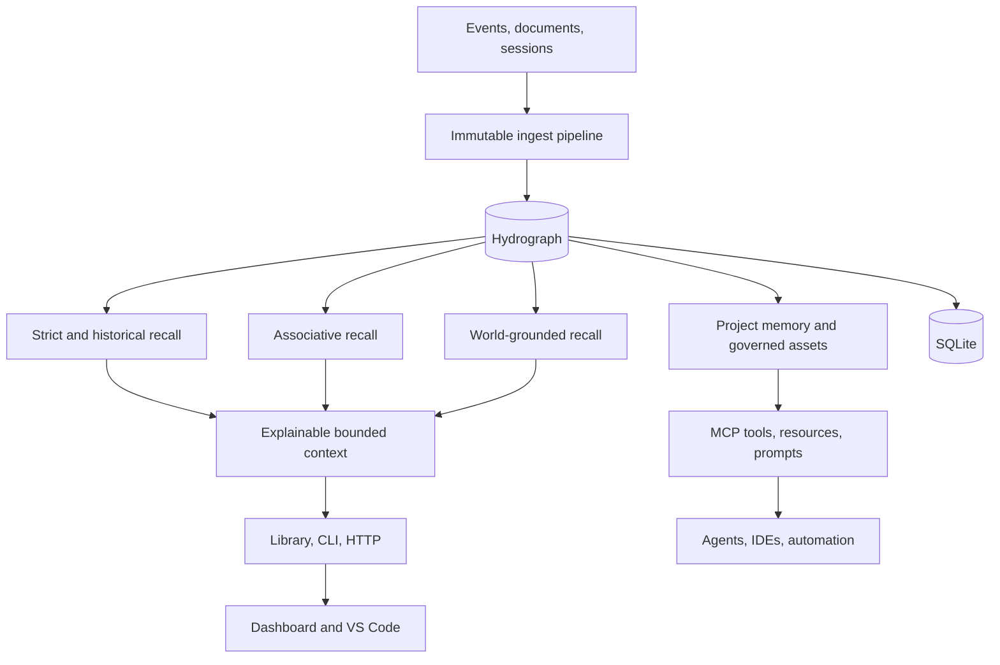

<!--
     __                      __  ___
    / /   ____  ____  ____ _/  |/  /__  ____ ___  ____  _______  __
   / /   / __ \/ __ \/ __ `/ /|_/ / _ \/ __ `__ \/ __ \/ ___/ / / /
  / /___/ /_/ / / / / /_/ / /  / /  __/ / / / / / /_/ / /  / /_/ /
 /_____/\____/_/ /_/\__, /_/  /_/\___/_/ /_/ /_/\____/_/   \__, /
                     /____/                                 /_____/

 cavira oss (c) 2026  -  nullure (c) 2026
 ==========================================================
 file  : README.md
 usage : introduces LongMemory, its architecture, integrations, and deployment options
-->

# LongMemory

> **Local-first, governed memory for AI agents and Codex.**

LongMemory keeps durable project knowledge in SQLite and gives each task only
the context it needs. Separate Codex tasks can stay focused while sharing
approved facts, decisions, lessons, and constraints.

- Four-level memory: project, role, task, and formal memory
- Bounded recall instead of loading the entire history
- Automatic capture with confirmation for major rules and conflicts
- Safe Codex history import with redaction and audit trails
- Governed L4-only links between otherwise isolated projects
- Read-only Obsidian projection for browsing and management
- Library, CLI, HTTP, MCP, dashboard, and VS Code surfaces

## Architecture



SQLite is the source of truth. Per-task working sets are derived, bounded, and
refreshed at safe turn boundaries; Obsidian is a projection, not a second
memory store.

## Quick start

This fork's Codex central-memory additions are currently distributed from
source.

```bash
git clone https://github.com/wakuwku/LongMemory.git
cd LongMemory
corepack enable
pnpm install --frozen-lockfile
pnpm build
pnpm link --global
longmemory version
```

Start the local API:

```bash
pnpm start
```

The API listens on `http://127.0.0.1:7331` by default.

Use LongMemory as a library:

```ts
import { createMemory } from 'longmemory';

const memory = await createMemory({
    store: 'sqlite',
    db_path: './longmemory.db',
    tenant_id: 'local',
    user_id: 'alice',
});

await memory.ingest({ text: 'Use SQLite for local persistence' });
const result = await memory.recall({
    text: 'Which database should this project use?',
    mode: 'strict',
});

console.log(result);
await memory.close();
```

## Codex central memory

| Level | Scope | Typical content |
| --- | --- | --- |
| L1 | Project | Purpose and rules that apply across the project |
| L2 | Role | What a Codex task or workstream is responsible for |
| L3 | Task | The current unit of work and its state |
| L4 | Formal memory | Decisions, methods, lessons, constraints, and solutions |

When a Codex task starts, it binds to a project and responsibility, receives a
compact hierarchy map, and recalls only relevant L4 memory. Current user
instructions always outrank recalled memory, and imported context stays
labelled separately from the live conversation.

At turn boundaries, useful outcomes can be written automatically. Major rules,
conflicting conclusions, locked memories, and sensitive history transitions
remain confirmation-gated.

### Install the Codex integration

After building and linking the CLI, add this repository as a Codex plugin
marketplace, install the `longmemory` plugin, restart Codex, and review the
bundled hook in `/hooks`.

See the [Codex integration guide](integrations/codex-longmemory/README.md) for
the exact installation, storage, hook, MCP, update, and recovery workflow.

By default, the plugin stores its central SQLite database and task registry
under Codex plugin data. Set an absolute `LONGMEMORY_DB_PATH` only when one
explicit shared location is required.

## Essential commands

```bash
# Ordinary memory
longmemory ingest "Remember the rollback procedure" --type procedure
longmemory recall "What is the rollback procedure?" --mode associative
longmemory project context "prepare the next release"

# Governed Codex history import
longmemory history inventory --from codex --all
longmemory history plan --from codex --all

# Explicit project links and Obsidian projection
longmemory project link list --db ./central-memory.db --project novel
longmemory obsidian project --db ./central-memory.db --vault ./KnowledgeVault

# Local MCP or HTTP service
longmemory mcp --db ./central-memory.db --project current
longmemory serve --mcp-http
```

The history flow is inventory → plan → human-confirmed assignment → import →
governed publication. Source conversations are never modified. Credential
matches block import unless the exact deterministic redaction proposal is
reviewed and confirmed.

See [the CLI reference](docs/cli.md) and
[history-import guide](docs/session-porter.md) for complete commands.

## Interfaces

| Surface | Purpose |
| --- | --- |
| TypeScript library | Embed memory directly in an application |
| CLI | Inspect, recall, import, govern, and maintain memory |
| MCP | Give agents scoped memory tools |
| HTTP API | Run LongMemory as a local or hosted service |
| Codex plugin | Load bounded context and finalize turns automatically |
| Obsidian | Browse a deterministic read-only Markdown projection |
| Dashboard | Search, inspect, chat, and manage memory |
| VS Code | Recall and inspect project context in the editor |

Supported integrations also include Claude Code, Gemini CLI, n8n, Cline,
Continue, LibreChat, Dify, Flowise, CrewAI, AutoGen, LangGraph/LangChain,
OpenAI Agents SDK, and PydanticAI.

## Deployment

| Platform | Entry point |
| --- | --- |
| Docker | `Dockerfile` |
| Docker Compose | `docker-compose.yml` |
| Windows | `start-longmemory.ps1` |
| Railway | `railway.json` |
| Render | `render.yaml` |
| Heroku | `app.json` |
| Vercel dashboard | `vercel.json` |

For network deployment, configure `LONGMEMORY_API_KEY`, persistent storage,
allowed origins, and TLS. Vercel hosts only the dashboard and requires a
separate LongMemory API.

## Validation

```bash
pnpm release:check
```

The release check covers public-file safety, unit tests, type checking,
integrations, benchmarks, builds, and the dashboard.

## Documentation

- [Codex integration](integrations/codex-longmemory/README.md)
- [Architecture](ARCHITECTURE.md)
- [CLI](docs/cli.md)
- [MCP](docs/mcp.md)
- [History import](docs/session-porter.md)
- [Migration](MIGRATION.md)
- [Security](SECURITY.md)

LongMemory is local-first, but recalled content remains untrusted evidence.
Keep credentials outside memory and repository files, preserve server-bound
identity, and require explicit human approval for high-impact decisions.
