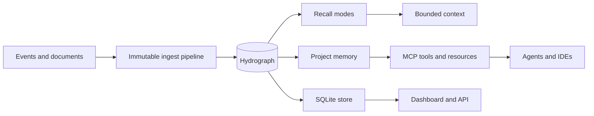

<!--
     __                      __  ___
    / /   ____  ____  ____ _/  |/  /__  ____ ___  ____  _______  __
   / /   / __ \/ __ \/ __ `/ /|_/ / _ \/ __ `__ \/ __ \/ ___/ / / /
  / /___/ /_/ / / / / /_/ / /  / /  __/ / / / / / /_/ / /  / /_/ /
 /_____/\____/_/ /_/\__, /_/  /_/\___/_/ /_/ /_/\____/_/   \__, /
                    /____/                                 /_____/

 cavira oss (c) 2026  -  nullure (c) 2026
 ==========================================================
 file  : docs/architecture.md
 usage : documents LongMemory architecture
-->

# LongMemory architecture

LongMemory is one TypeScript package with a shared Hydrograph engine. Library imports, the CLI, the HTTP server, MCP transports, the dashboard proxy, and integrations all use the same memory semantics.

## Core invariants

- Memory content and provenance are immutable; mutable lifecycle state is stored separately.
- Recorded time and valid time are distinct.
- Project, tenant, user, agent, and framework identity are enforced by the runtime.
- Recall is read-only and token bounded.
- Deny rules override grants for governed assets.
- SQLite is the local durable store; in-memory storage is available for embedded use.

## Surfaces

- `src/index.ts`: public package API.
- `src/cli`: deterministic CLI and interactive session porter.
- `src/server`: authenticated HTTP API and Streamable HTTP MCP endpoint.
- `src/mcp`: 13 governed tools, resources, prompts, and transports.
- `dashboard`: Next.js operational interface.
- `apps/vscode-extension`: native VS Code client over stable CLI JSON.
- `integrations`: host-native plugins, MCP configurations, and framework examples.
- `benchmarks`: auditable LongMemEval, LoCoMo, BEAM, and smoke harness.

Detailed subsystem documents live alongside this page in [`docs/`](.).
